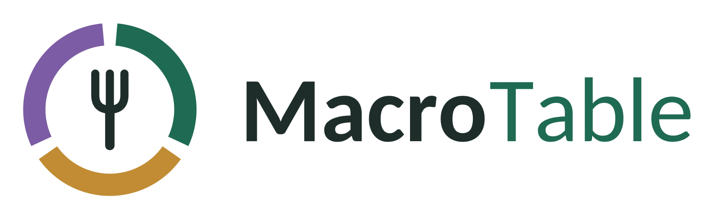

<p align="center"></p>

# MacroTable — V3.5 research prototype (product candidate)

> **MacroTable is a university research prototype. Restaurant integrations, nutrition values, health synchronization, commerce actions and orders are simulated unless explicitly stated otherwise.**

Team 44 · Information Strategy

**Live app:** https://mercouriss.github.io/macrotable-prototype/
**Repository:** https://github.com/mercouriss/macrotable-prototype

## Concept

MacroTable is a nutrition-aware food-commerce **agent**. **MacroAgent** understands what you want and gathers context: your remaining macros, budget and preferences, the restaurant you're at, and a scanned menu. It then invokes deterministic tools, explains the trade-offs and data confidence, and prepares an **in-store or pickup** order that you approve.

> **LLM interprets and orchestrates. Deterministic code calculates. Structured restaurant data defines what is possible. The user approves.**

```
TRIGGER (ask / scan / choose store) → GATHER CONTEXT → REASON + PLAN (choose tools)
→ ACT (find store, load menu, optimise, configure, draft order) → VERIFY (constraints, provenance, numbers) → HANDOFF (your approval)
```

## V3.5: product candidate

This is the last productization pass before the pilot and freeze. The audit, including what was deliberately **not** built, is in [docs/V3.5-AUDIT.md](docs/V3.5-AUDIT.md).

- **Home is a product home.**
  - Remaining macros and budget.
  - One primary action: *Find my next meal*.
  - "Good options nearby", taken straight from the deterministic optimizer.
  - A fast route to MacroAgent.
  - Saved meals, then scanning.
- **The recommendation screen answers WHAT / WHY / CHANGE / CONFIDENCE / PRICE / ACTION at a glance.**
  - "Best feasible match".
  - Target-vs-meal bars (`MacroFit`), with the ±10 % calorie range and the protein minimum.
  - "MacroTable changed".
  - "How reliable is this?".
  - *Configure order* → *Review order* → *Approve order*.
- **Explore is populated and honest.** 29 places: 10 fictional **DEMO** brands (monogram pins; 6 around campus, 4 farther out at 1–2.5 km) and **19 real, unaffiliated restaurants** (dashed dots; name and location only, each verified 2026-09-29 against its own website and OpenStreetMap).
  - Search.
  - Filters: *Best macro fit · High protein · Within budget · Vegetarian · MacroTable Demo · Real restaurants*. Nutrition filters never include real restaurants.
  - Real places say "Scan the menu to check your fit".
- **MacroAgent cards** show fit bars, "why this fits", "MacroTable changed" and a *Configure order* button. The store list shows the demo brands plus the 3 nearest real places.
- **Saved meals and order again**, stored in this browser only.
- **MacroTable Premium concept** (Profile).
  - €7.99/month or €59.99/year, labelled *prototype pricing / concept — no billing*.
  - Built features are marked apart from concept-only ones.
  - Everything that exists stays unlocked, so Free is never crippled and the experiment is untouched.
  - It shows how MacroTable would earn money, with a no-paid-placement rule.
- **Research isolation.**
  - Trials in both arms use the **frozen study dataset** (FitKitchen, Urban Bowl, Local Grill).
  - Premium, saved meals and the "Prototype & research" tools are hidden in trials.
  - Scenario calibration is unchanged.

## V3.1: realism, UX and presentation

- **Real restaurants, honestly.** Sally's Salads, Mozza and Erasmus Paviljoen (Erasmus campus, Rotterdam) are real places. Their name and location were verified on 2026-09-29 (own website + OpenStreetMap).
  - They're shown as **"Real · not affiliated"**.
  - The prototype has **no** menu, prices, nutrition, hours or ordering for them. MacroAgent offers **Scan the menu here** instead.
  - The menu-carrying restaurants (FitKitchen, Urban Bowl, Local Grill) are fictional **DEMO** brands.
  - One dataset (`src/data/restaurants.ts`) drives the map, cards, restaurant pages, agent tools, QR demos and orders.
- **Labels:** simulated data is labelled **DEMO VERIFIED / DEMO OFFICIAL**. MENU-READ, ESTIMATED and INSUFFICIENT are unchanged.
- **Agent step states** reflect real tool activity, never reasoning traces.
- **Explore:** pin → card, stacked labels.
- **Desktop showcase** (≥1024 px): the interactive phone sits beside a product-demo video. Configure the video with `VITE_SHOWCASE_VIDEO_URL`, or the repo variable `SHOWCASE_VIDEO_URL` in CI; it accepts a YouTube, Vimeo or https embed URL, or a `.mp4`/`.webm` URL or path in `public/`. Unset shows a placeholder.
  - Below 1024 px only the app renders, and the video is never mounted.
  - The showcase is hidden from study participants.
- **Freeze fingerprint** on `/research`.
- Full audit: [docs/V3.1-AUDIT.md](docs/V3.1-AUDIT.md).

> Prototype demonstration: restaurant identities/locations marked "Real" are real and not affiliated with MacroTable. Demo restaurants, MacroTable integrations, menus, nutrition, availability and ordering are simulated.

## What's new in V3

- **Agent tab** (`Home | Explore | Agent | Scan | Profile`), plus contextual **Ask MacroAgent** buttons on Home, Explore, restaurant, meal, QR and menu-scan screens. All of them open the same persistent agent session.
- **Tools** (`src/agent/tools.ts`): `getUserContext`, `listNearbyStores`, `getMenu`, `optimizeMeal`, `explainProvenance`, `analyzeMenuImage`, `prepareOrder`.
  - Requests like *"less rice"* become structured adjustments. They are resolved only against **restaurant-supported** options, and refused with an explanation otherwise.
- **Engines:**
  - **Gemini** (live) through a secure **Cloudflare Worker proxy** ([proxy/README.md](proxy/README.md)).
  - An **offline MockAgent** that calls the same tools. It takes over automatically, and says so, when the live model is missing or fails.
- **VERIFY:** cards and numbers always come from tool results. Any number in the model's text that no tool produced is flagged.
- **Explore map:** Leaflet with OpenStreetMap tiles (attributed), showing real (dashed) and DEMO pins near the Erasmus campus in Rotterdam (`src/data/geo.ts`, `src/data/restaurants.ts`). An illustrated map replaces the tiles when they fail or you're offline.
- **Scan:**
  - Known restaurant QR → the agent opens with that restaurant's verified menu.
  - Unknown QR → "MacroTable doesn't have verified menu data here" plus *Scan menu instead*.
  - **Menu photo** → stored only on the device (IndexedDB, 30-minute TTL, *Delete scan*) → sent to Gemini **only after explicit consent** → validated structured extraction → the same optimizer → MacroAgent.
- **Provenance scale:** VERIFIED · OFFICIAL · MENU-READ · ESTIMATED · INSUFFICIENT.
- **Ordering scope:** in-store or pickup only (pickup code, kitchen ticket). Non-integrated restaurants and scanned menus get a counter hand-off. No delivery, no payments.

## Install, run, test, build

Requires Node 20+ (CI uses Node 24).

```bash
npm install
npm run dev          # http://localhost:5173
npm run typecheck
npm test             # Vitest — optimizer, research, agent tools/loop, proxy, scans, camera
npm run build
```

- **Live agent locally:** set `VITE_AGENT_PROXY_URL` in `.env.local` (see `.env.example`). Without it the app uses the offline demo agent.
- **Live agent in production:** deploy the proxy ([proxy/README.md](proxy/README.md)) and set the repo variable `AGENT_PROXY_URL`. CI reads it at build time.

CI (`.github/workflows/ci.yml`): `npm ci → typecheck → test → build → deploy to GitHub Pages` on every push to `main`.

## Routes

| Route | Purpose |
|---|---|
| `/macrotable` | Home (first visit shows onboarding) |
| `/macrotable/agent` | **MacroAgent** workspace |
| `/macrotable/explore`, `/macrotable/explore/:id` | Map, store cards, restaurant menu |
| `/macrotable/scan` | Scan hub → `?type=menu` (photo) / `?type=qr` |
| `/r/:restaurantId` | Table-QR landing page (opened by the phone's own camera) |
| `/macrotable/preferences → search → results → meal → configure → review` | Guided (V2) flow, still available |
| `/macrotable/success/:n`, `/macrotable/ticket/:n` | Pickup/in-store confirmation and kitchen ticket |
| `/macrotable/profile`, `/macrotable/orders` | Profile, Settings (Live AI: *Use Gemini API*, default OFF), your orders |
| `/baseline` | Conventional ordering (control) |
| `/experiment?participant=&condition=&scenario=` | Participant assignment link |
| `/research` | Researcher dashboard |
| `/demo` · `/privacy` | Demo reset · prototype privacy notice |

## Camera, HTTPS and privacy

- The camera starts **only after a tap**, prefers the rear camera and never uses audio. Tracks stop on capture, cancel, leaving the screen or backgrounding. Denied, unavailable, busy, HTTPS-only and unsupported states each show a message, and **Upload photo** is always available.
- Menu photos are kept in IndexedDB for at most 30 minutes and can be deleted any time. They're never included in research exports and never committed.
- A menu photo is sent to Gemini only after the user taps **Send photo to Gemini**, with disclosure. The offline sample is labelled *"not read from your photo"*.
- Live chat text goes to Gemini via the proxy. **On Gemini's free tier Google may use submitted content to improve its products**, and the Agent tab and privacy notice say so. Research logs record message counts and tool names, **never message text**.
- Map tiles load from OpenStreetMap. The app never uses your real location.

## Research

The V2 study infrastructure is unchanged and now agent-aware: participant links, condition lock, a neutral end screen, the dashboard and CSV/JSON export with `agent_messages`, `agent_tool_calls`, `agent_provider` and `agent_fallbacks` columns. **V3 changes the treatment, so V2 pilot observations must not be combined with V3 data.** See [docs/EXPERIMENT.md](docs/EXPERIMENT.md) and [docs/study/](docs/study/README.md).

## What is simulated

The demo brands and their menus, recipes, prices, nutrition and locations are fictional, as are all restaurant integrations (levels 1–3). Real restaurants are real in name and location only. Also simulated: the Premium pricing concept (no billing), order sending, kitchen tickets, pickup codes, payments (none), the "logged today" macros, and the offline sample menu extraction.

**Real:** the identity and location of the 19 unaffiliated restaurants, the camera, QR decoding, the deterministic optimizer and tools, the Gemini call via the proxy (once deployed), OpenStreetMap tiles, IndexedDB scan storage, local research logging and exports, and the PWA.

## Known limitations

- **The live agent needs the proxy deployed with your Gemini key.** Until then every agent reply comes from the offline demo agent, which is honestly labelled but only understands common intents and quick replies.
- The Gemini integration is tested against the documented API shapes (mocked). It hasn't been exercised against the live API from this build environment.
- Scanned-menu dishes can't be modified, because printed extras have no nutrition data. Estimates for them are AI-inferred and labelled ESTIMATED.
- Nutrition data is invented, and modifier deltas are additive. The ±10 % calorie rule and ranking weights are prototype choices.
- Research data is per-device localStorage, so export after each session. See [docs/DEMO.md](docs/DEMO.md#real-device-checklist) for real-device status.

## Documentation

[docs/ARCHITECTURE.md](docs/ARCHITECTURE.md) · [docs/EXPERIMENT.md](docs/EXPERIMENT.md) · [docs/DATA_MODEL.md](docs/DATA_MODEL.md) · [docs/DEMO.md](docs/DEMO.md) · [docs/study/](docs/study/README.md) · [proxy/README.md](proxy/README.md)
